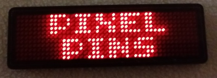
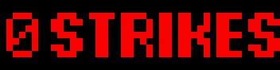

## What are PixelPins :question:
They're like personalized pinball DMD displays[^1] you can wear. \
Use it as a fashion statement, or a tournament status tracker. \
Each can store up to 8 different things, chosen with a button.

## What can I put on them :question:
- [more than 40 pinball and arcade animations to choose](art/) \
  <kbd></kbd>
- [pinball (knockout) tournament status](art_knockout/) \
  <kbd></kbd>
- [custom messages](custom_text/) \
  <kbd></kbd>

## Tell me more :exclamation:
- Lightweight, with a built in pin to attach to clothing and an optional magnet.
- 4 selectable brightness settings[^2]
- 4 color choices
  - red, blue, white, and yellow.
- 8 customizable slots for messages
  - Animation or message text
  - Each one plays on a loop
  - A ninth demo mode plays all the slots, a single time through, in a loop
- 14+ hours of power on a full charge[^3]
  - Rechargeable battery takes about an hour to charge when empty[^4]
  - Comes with a Micro USB cable for charging
- Available at the [Pinball Wrestling](https://pinballwrestling.com/) booth at [The Northwest Pinball & Arcade Show](https://www.nwpinballshow.com/)

## Can I update it myself :question:
Yes! More information [here](how_to_update/).

## What are people saying :question:
Show me customer [testimonials](testimonials/)

## Signup for more information :question:
If you're interested in signing up for updates with your email address, there's a [form here](https://adcockm.pythonanywhere.com/). If sold out, it takes about 2-3 weeks to order more. Depending on interest, I might do pre-orders for the next batch. Thanks!

## 
[^1]: 44x11 pixel resolution, so a lot smaller than a DMD which is 128x32.
[^2]: 100% brightness is *very* bright. 75% is recommended.
[^3]: On a full charge: 14.5 hours at 100% brightness, 21 hours at 25% brightness.
[^4]: Testing showed the battery took 1 hour and 15 minutes to fully charge.
