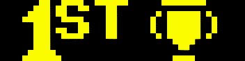
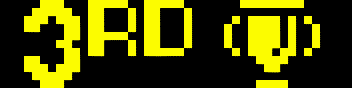
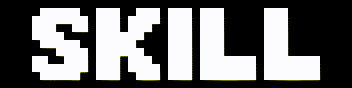
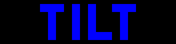

<a href="../">Back to PixelPins home</a>

# Animations
Many different animations can be put on the badge.\
There are a maximum of 8 slots per badge, so choose up to 8 different animations.[^1]\
Any of the slots can be used for [custom messages](../custom_text) instead of animations.

## Arcade and Video Games

|  |  |
|  :---:    |  :---        |
|  <kbd></kbd>  |  Badge Invaders 1  |
|  <kbd></kbd>  |  Badge Invaders 2  |
|  <kbd></kbd>  |  Badge Invaders 3  |
|  <kbd></kbd>  |  Creepy Crawlie  |
|  <kbd></kbd>  |  Froggy  |
|  <kbd></kbd>  |  Intruder Alert!  |
|  <kbd></kbd>  |  Chomp chomp!  |
|  <kbd></kbd>  |  Ostrich Fly  |
|  <kbd></kbd>  |  Ostrich Walk  |
|  <kbd></kbd>  |  Bat!  |
|  <kbd></kbd>  |  The Code  |

## Pinball Tourney Set 1

|  |  |
|  :---:    |  :---        |
|  <kbd></kbd>  |  No Strikes (video game)  |
|  <kbd></kbd>  |  1 Strike (video game)  |
|  <kbd></kbd>  |  2 Strikes (video game)  |
|  <kbd></kbd>  |  3 Strikes (video game)  |
|  <kbd></kbd>  |  1st Place  |
|  <kbd></kbd>  |  2nd Place  |
|  <kbd></kbd>  |  3rd Place  |
|  <kbd></kbd>  |  Are you good at pinball?  |

## Pinball Tourney Set 2

|  |  |
|  :---:    |  :---        |
|  <kbd></kbd>  |  No Strikes  |
|  <kbd></kbd>  |  1 Strike  |
|  <kbd></kbd>  |  2 Strikes  |
|  <kbd></kbd>  |  3 Strikes  |
|  <kbd></kbd>  |  1st Place  |
|  <kbd></kbd>  |  2nd Place  |
|  <kbd></kbd>  |  3rd Place  |
|  <kbd></kbd>  |  Are you good at pinball?  |

## Optional for Tourney Sets

|  |  |
|  :---:    |  :---        |
|  <kbd></kbd>  |  4th Place  |

## Local Pinball Scene

|  |  |
|  :---:    |  :---        |
|  <kbd></kbd>  |  What time is it?  |
|  <kbd></kbd>  |  How many points do we need?  |
|  <kbd></kbd>  |  Pinball Etiquette  |
|  <kbd></kbd>  |  The Theatre of Magic awaits...  |
|  <kbd></kbd>  |  The `Zine on the scene!  |
|  <kbd></kbd>  |  SPECIALS!!!  |
|  <kbd></kbd>  |  For the Pinball Wrestling fans!  |

## Pinball Miscellanea

|  |  |
|  :---:    |  :---        |
|  <kbd></kbd>  |  Extra Ball  |
|  <kbd></kbd>  |  Shoot Again  |
|  <kbd></kbd>  |  Special When Lit  |
|  <kbd></kbd>  |  TILT  |

## Work in Progress...

|  |  |
|  :---:    |  :---        |
|  <kbd></kbd>  |  Galaga ship, but *what will it do?*  |

[^1]: It may not be possible to use 8 of the longest animations on the same badge due to memory limits. (The video game characters at the top are the largest.)
